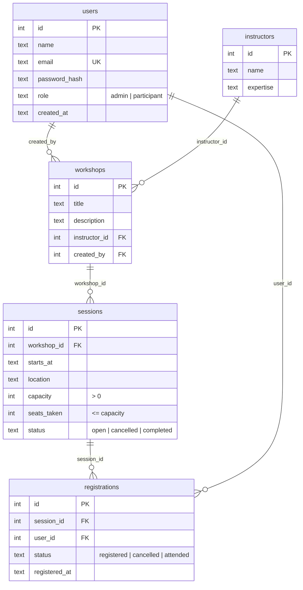

# SOFTWARE METRICS AND QUALITY ASSURANCE QUALIFICATION

Submitted by: AT25-1

Theme: **Workshop & Training Registration**

[QUICK START / VERSI CEPAT]
Pastiin Node.js (v20.17 ke atas) sama Google Chrome udah ke-install. Terus buka terminal di folder project ini dan jalanin:

```bash
npm install
npm run test:selenium:demo
npm run start
```

- `npm run test:selenium:demo` -> Part A (Selenium). Chrome bakal kebuka dan jalan pelan-pelan biar keliatan tiap langkahnya.
- `npm run start` -> Part B (API) nyala di http://localhost:3030

Database-nya otomatis dibikin dan diisi data dummy pas `npm run start` pertama kali, jadi gak perlu setup manual.

PENTING:
Part A butuh koneksi internet (buka saucedemo.com). Port 3030 harus kosong (Grafana pakai 3000, jadi aman).

---

For those who prefer the manual or detailed explanation, read below:

## WHAT'S INSIDE

| Case task | Where to look | Status |
|---|---|---|
| Task 1 - Selenium login automation | `selenium/login.e2e.ts` | Done |
| Task 2 - NestJS backend, raw SQLite, auto seeding | `src/` (SQL and seeding in `src/database/`) | Database done, endpoints in progress |
| Task 3 - Jest suite (201 / 400 / 404 / 403) | `src/registrations/registrations.spec.ts` | In progress |
| Task 4 - K6 load test | `test-load.js` | In progress |
| Task 5 - Prometheus telemetry | `GET /metrics`, `prometheus.yml` | In progress |
| Task 6 - Grafana dashboard | `custom-app-dashboard.json` | In progress |

## HOW TO RUN AND VERIFY

### 0. Install

```bash
npm install
```

`sqlite3` downloads a prebuilt binary, so nothing needs to be compiled.

### Part A - Selenium (Task 1)

Target site: https://www.saucedemo.com/

| Command | What you see |
|---|---|
| `npm run test:selenium` | Visible Chrome at normal speed |
| `npm run test:selenium:demo` | 1s pause after each action, 3s before each browser closes |
| `npm run test:selenium -- --headless` | No browser window |

Expected result (Node's built-in test runner):

```
▶ saucedemo login
  ✔ 1. valid login lands on inventory with 6 products
  ✔ 2. invalid password shows credential error
  ✔ 3. locked-out user shows locked-out error
[PERFORMANCE] Test failed: waiting for a missing element exceeded 15s
  ✔ 4. 15s timeout handler fires and closes the session
ℹ pass 4
ℹ fail 0
```

Test 1 also prints a table of the 6 product names and prices, and every test prints `session closed`.

| Test | What it checks |
|---|---|
| 1 | Types `standard_user` / `secret_sauce`, clicks Login, then asserts the URL contains `/inventory.html`, the product list is visible, and 6 products each have a name and a `$x.xx` price |
| 2 | Wrong password: the error says the username and password do not match, the URL did not change, no product list |
| 3 | `locked_out_user`: the error says the user is locked out |
| 4 | Waits for an element that never exists: after 15s it prints the `[PERFORMANCE]` message and closes the browser |

Synchronization: explicit waits with a 15s limit, page load timeout 15s, implicit wait 0. Every test opens its own browser and always closes it.

Check that it really fails when it should: change `EXPECTED_PRODUCT_COUNT` to `7` in `selenium/login.e2e.ts` and run again. Test 1 shows `✖` with `actual: 6, expected: 7`, and the exit code is 1 (`$LASTEXITCODE` in PowerShell). Change it back afterwards.

### Part B - Backend (Task 2)

```bash
npm run start
```

Expected log on the first start:

```
[DatabaseService] Seeded data/app.db: users=5 instructors=3 workshops=4 sessions=7 registrations=8
[Bootstrap] Listening on http://localhost:3030
```

On every later start it says `Existing data in data/app.db` with the same counts, so the data is never seeded twice. To start from a clean database, stop the app, delete the `data` folder and start again.

| Setting | Default | Override |
|---|---|---|
| Port | `3030` | `PORT` |
| Database file | `data/app.db` | `DB_PATH` |

#### Seed accounts

| Role | Email | Password |
|---|---|---|
| admin | `admin@workshop.local` | `Admin123!` |
| participant | `alice@workshop.local`, `budi@workshop.local`, `citra@workshop.local`, `dewi@workshop.local` | `Participant123!` |

Passwords are stored as scrypt hashes (`salt:hash`), never in plain text.

#### Database schema



A user can register for a session only once (`UNIQUE (session_id, user_id)`).

#### Seeded sessions worth knowing

| Session | Seats | Why it is there |
|---|---|---|
| 3 | 2 / 2 | Full, used for the "session is full" (400) case |
| 7 | 0 / 40 | Status `cancelled`, used for the "not open" (400) case |

## TROUBLESHOOTING

- `EADDRINUSE` on port 3030: another copy of the app is still running. Stop it, or start on another port with `$env:PORT=3031; npm run start` in PowerShell.
- Selenium cannot start Chrome: install Google Chrome. The first run also needs internet access to download chromedriver.
- A `[PERFORMANCE]` message on tests 1-3: saucedemo.com took longer than 15s to respond. Check your connection and run again.
- `npm install` fails on `sqlite3`: use Node.js 20.17 or newer (the prebuilt binary needs it).

## DEPENDENCIES

- Node.js 20.17 or newer with npm (tested on 22.14)
- Google Chrome

## Project Notice

This project is an **independent implementation** created by me
for learning and teaching purposes related to
courses at **Bina Nusantara University**.

The problem scenario is inspired by an academic case.
All source code, architecture, and implementation
are my original work.

This repository is public for **portfolio and educational viewing only**.
Reuse for academic submission or grading purposes
is **strongly discouraged**.

## - Saputra Tanuwijaya ( AT )
