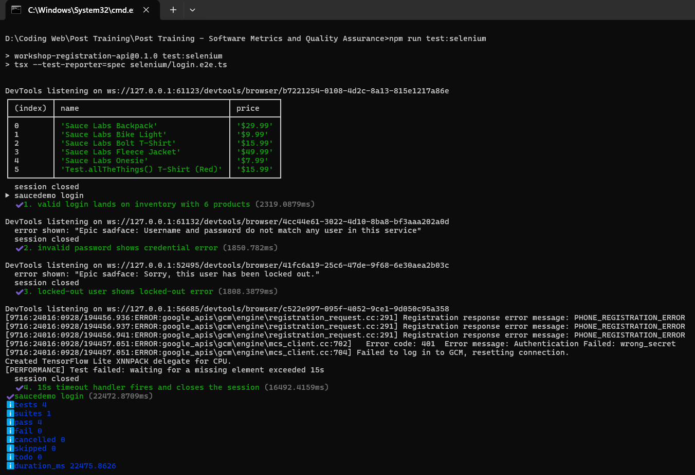
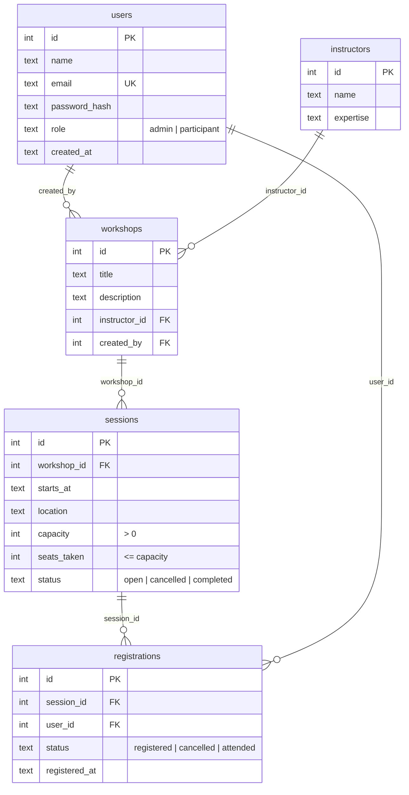
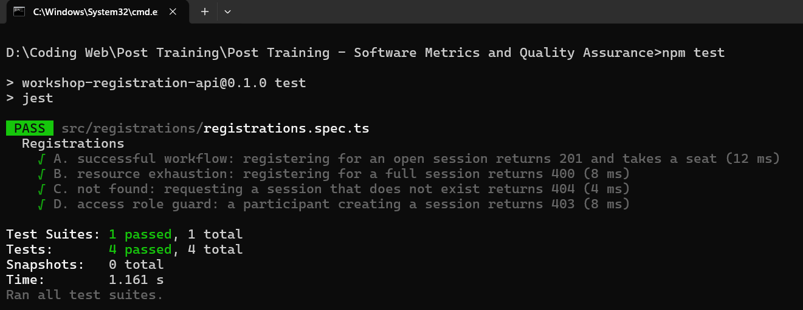
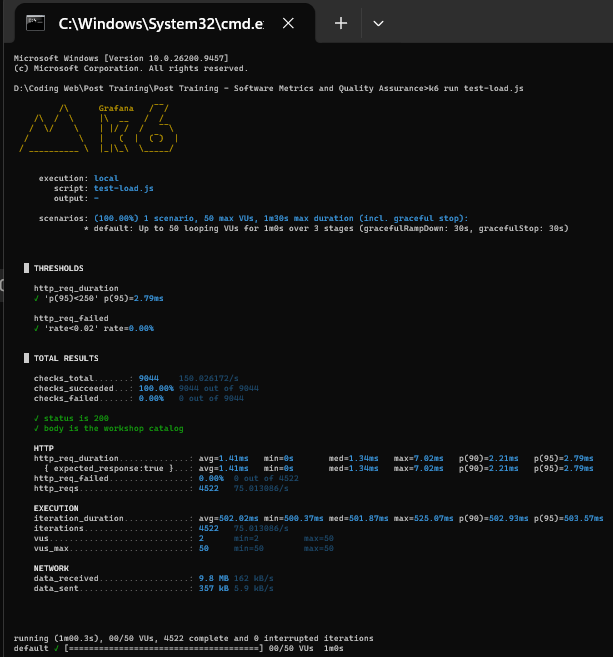
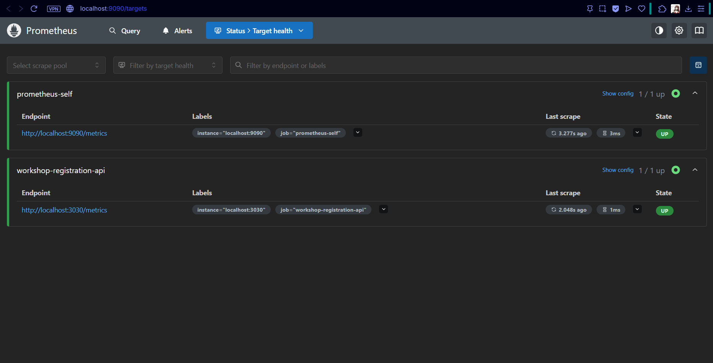
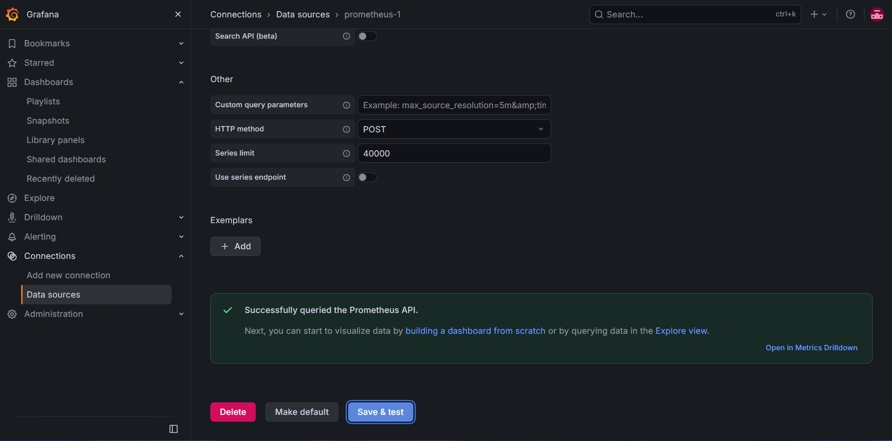
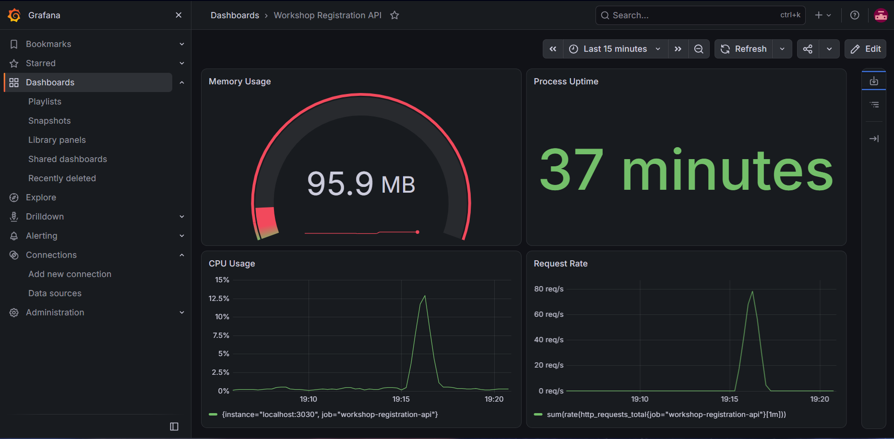

# SOFTWARE METRICS AND QUALITY ASSURANCE QUALIFICATION

Submitted by: AT25-1

Theme: **Workshop & Training Registration**

[QUICK START / VERSI CEPAT]
Jalanin pakai "LAUNCH_ME.bat" kalau gamau pusing (literally tinggal double-click).
Script ini bakal otomatis install dependencies, jalanin Jest test, nyalain API-nya, jalanin Selenium (Chrome kebuka pelan-pelan biar keliatan), terus jalanin load test k6.

PENTING:
Pastiin Node.js (v20.17 ke atas) sama Google Chrome udah ke-install, dan ada koneksi internet (Selenium buka saucedemo.com).
Jangan tutup jendela Chrome pas Selenium lagi jalan, test ke-4 emang sengaja nunggu 15 detik.
API-nya jalan di jendela sendiri ("Workshop Registration API"), tutup jendela itu kalau mau matiin.

---

For those who prefer the manual or detailed explanation, read below:

## HOW TO RUN

1. Install Node.js 20.17 or newer and Google Chrome.
2. Double-click `LAUNCH_ME.bat`.
   (Note: if Windows protects your PC, click 'More info' -> 'Run anyway'.)
3. Prometheus and Grafana are started separately, see the Task 5 and Task 6 sections below.

## WHAT THE LAUNCHER DOES

1. Checks that Node.js is installed.
2. Runs `npm install`.
3. Runs the Jest suite (scenarios A-D).
4. Starts the API on http://localhost:3030 in its own window (the database is created and seeded automatically), or reuses it if it is already running.
5. Runs the Selenium demo: Chrome opens and runs the 4 login scenarios slowly enough to watch.
6. Runs the k6 load test if `k6` is on your PATH (skipped with a message if not).
7. Opens http://localhost:3030/metrics in your browser.

## WHAT'S INSIDE

| Case task | Where to look |
|---|---|
| Task 1 - Selenium login automation | `selenium/login.e2e.ts` |
| Task 2 - NestJS backend, raw SQLite, auto seeding | `src/` (SQL and seeding in `src/database/`) |
| Task 3 - Jest suite (201 / 400 / 404 / 403) | `src/registrations/registrations.spec.ts` |
| Task 4 - K6 load test | `test-load.js` |
| Task 5 - Prometheus telemetry | `GET /metrics`, `prometheus.yml` |
| Task 6 - Grafana dashboard | `custom-app-dashboard.json` |

## PORTS

| Service | URL |
|---|---|
| Workshop Registration API | http://localhost:3030 |
| Prometheus | http://localhost:9090 |
| Grafana | http://localhost:3000 |

The API uses 3030 because Grafana owns 3000.

## HOW TO RUN AND VERIFY

### 0. Install

```bash
npm install
```

`sqlite3` downloads a prebuilt binary, so nothing needs to be compiled.

### Part A - Selenium (Task 1)

Target site: https://www.saucedemo.com/

| Command | What you see |
|---|---|
| `npm run test:selenium` | Visible Chrome at normal speed |
| `npm run test:selenium:demo` | 1s pause after each action, 3s before each browser closes |
| `npm run test:selenium -- --headless` | No browser window |

Expected result (Node's built-in test runner):

```
▶ saucedemo login
  ✔ 1. valid login lands on inventory with 6 products
  ✔ 2. invalid password shows credential error
  ✔ 3. locked-out user shows locked-out error
[PERFORMANCE] Test failed: waiting for a missing element exceeded 15s
  ✔ 4. 15s timeout handler fires and closes the session
ℹ pass 4
ℹ fail 0
```

Test 1 also prints a table of the 6 product names and prices, and every test prints `session closed`.

| Test | What it checks |
|---|---|
| 1 | Types `standard_user` / `secret_sauce`, clicks Login, then asserts the URL contains `/inventory.html`, the product list is visible, and 6 products each have a name and a `$x.xx` price |
| 2 | Wrong password: the error says the username and password do not match, the URL did not change, no product list |
| 3 | `locked_out_user`: the error says the user is locked out |
| 4 | Waits for an element that never exists: after 15s it prints the `[PERFORMANCE]` message and closes the browser |

Synchronization: explicit waits with a 15s limit, page load timeout 15s, implicit wait 0. Every test opens its own browser and always closes it.

Check that it really fails when it should: change `EXPECTED_PRODUCT_COUNT` to `7` in `selenium/login.e2e.ts` and run again. Test 1 shows `✖` with `actual: 6, expected: 7`, and the exit code is 1 (`$LASTEXITCODE` in PowerShell). Change it back afterwards.



The `ERROR:google_apis\gcm` and `DevTools listening` lines come from Chrome itself (its background services in a fresh test profile), not from the test.

### Part B - Backend (Task 2)

```bash
npm run start
```

Expected log on the first start:

```
[DatabaseService] Seeded data/app.db: users=5 instructors=3 workshops=4 sessions=7 registrations=8
[Bootstrap] Listening on http://localhost:3030
```

On every later start it says `Existing data in data/app.db` with the same counts, so the data is never seeded twice. To start from a clean database, stop the app, delete the `data` folder and start again.

| Setting | Default | Override |
|---|---|---|
| Port | `3030` | `PORT` |
| Database file | `data/app.db` | `DB_PATH` |
| JWT signing secret | a development default | `JWT_SECRET` |

#### Seed accounts

| Role | Email | Password |
|---|---|---|
| admin | `admin@workshop.local` | `Admin123!` |
| participant | `alice@workshop.local`, `budi@workshop.local`, `citra@workshop.local`, `dewi@workshop.local` | `Participant123!` |

Passwords are stored as scrypt hashes (`salt:hash`), never in plain text.

#### Database schema



A user can register for a session only once (`UNIQUE (session_id, user_id)`).

#### Seeded sessions worth knowing

| Session | Seats | Why it is there |
|---|---|---|
| 3 | 2 / 2 | Full, used for the "session is full" (400) case |
| 7 | 0 / 40 | Status `cancelled`, used for the "not open" (400) case |

#### Endpoints

Authentication is **JWT**: log in with `POST /auth/login`, then send `Authorization: Bearer <accessToken>`. Tokens expire after 1 hour. Missing, invalid or expired token -> 401. Wrong role -> 403.

| Method + path | Access | Success | Errors |
|---|---|---|---|
| `POST /auth/login` `{ email, password }` | public | 200 `{ accessToken }` | 400 bad input, 401 wrong credentials |
| `GET /workshops` | public | 200 catalog with instructor and sessions (incl. `seatsLeft`) | - |
| `GET /sessions/:id` | public | 200 session | 400 bad id, 404 not found |
| `POST /sessions` `{ workshopId, startsAt, location, capacity }` | admin | 201 session | 400 bad input, 403 not admin, 404 workshop not found |
| `DELETE /sessions/:id` | admin | 204 | 403 not admin, 404 not found, 409 session has registrations |
| `POST /registrations` `{ sessionId }` | participant | 201 registration, seat taken | 400 full / not open / bad input, 403 not participant, 404 session not found, 409 already registered |
| `PATCH /registrations/:id/cancel` | owner | 200 registration, seat freed | 403 not the owner, 404 not found, 409 not `registered` |
| `PATCH /registrations/:id/attend` | admin | 200 registration | 403 not admin, 404 not found, 409 not `registered` |

Every write runs inside a database transaction. Registering takes a seat with one conditional `UPDATE ... WHERE seats_taken < capacity`, so two people can never get the last seat.

Validation is manual (no `class-validator`): ids must be positive integers, `startsAt` must be an ISO 8601 date-time with a timezone and in the future, `location` 1-100 characters, `capacity` an integer from 1 to 500. Anything else returns 400 with a message naming the field.

#### Try it yourself

In Git Bash (with the app running):

```bash
TOKEN=$(curl -s -X POST localhost:3030/auth/login -H 'Content-Type: application/json' \
  -d '{"email":"budi@workshop.local","password":"Participant123!"}' | sed -E 's/.*"accessToken":"([^"]+)".*/\1/')

curl -i -X POST localhost:3030/registrations -H "Authorization: Bearer $TOKEN" -H 'Content-Type: application/json' -d '{"sessionId":4}'
curl -i -X POST localhost:3030/registrations -H "Authorization: Bearer $TOKEN" -H 'Content-Type: application/json' -d '{"sessionId":3}'
curl -i localhost:3030/sessions/999999
curl -i -X POST localhost:3030/sessions -H "Authorization: Bearer $TOKEN" -H 'Content-Type: application/json' -d '{}'
```

Expected: `201 Created`, then `400` (session 3 is full), then `404`, then `403` (budi is not an admin). Run the first registration twice and the second attempt returns `409`.

In PowerShell, log in and register like this:

```powershell
$token = (Invoke-RestMethod -Method Post http://localhost:3030/auth/login -ContentType 'application/json' -Body '{"email":"budi@workshop.local","password":"Participant123!"}').accessToken
Invoke-RestMethod -Method Post http://localhost:3030/registrations -Headers @{ Authorization = "Bearer $token" } -ContentType 'application/json' -Body '{"sessionId":4}'
```

### Part B - Jest (Task 3)

```bash
npm test
```

No server needs to be running. Each run starts the app in memory (`DB_PATH=:memory:`), creates and seeds a fresh database, and never touches `data/app.db`.

Expected result:

```
PASS src/registrations/registrations.spec.ts
  Registrations
    √ A. successful workflow: registering for an open session returns 201 and takes a seat
    √ B. resource exhaustion: registering for a full session returns 400
    √ C. not found: requesting a session that does not exist returns 404
    √ D. access role guard: a participant creating a session returns 403

Tests:       4 passed, 4 total
```

| Scenario | Request | Asserts |
|---|---|---|
| A. Successful workflow | participant `POST /registrations { sessionId: 4 }` | 201, body is the registration, `seats_taken` went up by 1, and a `registered` row exists for that participant in the database |
| B. Resource exhaustion | participant `POST /registrations { sessionId: 3 }` (full) | 400, and `seats_taken` is still 2 |
| C. Not found | `GET /sessions/999999` | 404 |
| D. Access role guard | participant `POST /sessions` with a valid body | 403, and no session was created |

The participant logs in through `POST /auth/login` first, so D fails on the role, not on a missing token.

Check that the tests really catch mistakes: in `src/sessions/sessions.controller.ts`, delete the `@Roles('admin')` line above `create`, then run `npm test`. Scenario D fails with `expected 403 "Forbidden", got 201 "Created"`. Put the line back afterwards.



### Part B - K6 load test (Task 4)

Start the app in one terminal, then run k6 from the repo root in another:

```bash
npm run start
```

```bash
k6 run test-load.js
```

| Stage | Duration | Virtual users |
|---|---|---|
| Ramp-up | 15s | 0 -> 50 |
| Steady load | 30s | 50 |
| Ramp-down | 15s | 50 -> 0 |

Each virtual user calls `GET /workshops` (the public catalog), checks the response, then waits 0.5s (think time), so the peak load is about 100 requests per second.

Expected result (the numbers vary a little per machine):

```
  █ THRESHOLDS

    http_req_duration
    ✓ 'p(95)<250' p(95)=2.21ms

    http_req_failed
    ✓ 'rate<0.02' rate=0.00%

    ✓ status is 200
    ✓ body is the workshop catalog
    http_reqs......................: 4525   75.1/s
```

k6 exits with code 0 when both thresholds pass and 99 when one fails (`$LASTEXITCODE` in PowerShell).

Check that the thresholds really gate the result: stop the app and run `k6 run test-load.js` again. `http_req_failed` jumps to 100%, the summary shows `✗ 'rate<0.02'`, and k6 exits with 99. To target another host or port, use `k6 run -e BASE_URL=http://localhost:3031 test-load.js`.



If Prometheus is running during the test, the request spike (about 100 req/s) shows up in `http_requests_total` and in the Grafana Request Rate panel.

### Part B - Prometheus telemetry (Task 5)

With the app running (`npm run start`), open http://localhost:3030/metrics or run:

```bash
curl http://localhost:3030/metrics
```

It returns plain Prometheus text (no login needed). Lines to look for:

```
# TYPE process_resident_memory_bytes gauge
process_resident_memory_bytes 76255232
# TYPE process_cpu_seconds_total counter
process_cpu_seconds_total 0.094
# TYPE process_uptime_seconds_total gauge
process_uptime_seconds_total 4.53
http_requests_total{method="GET",route="/workshops",status="200"} 3
```

| Metric | Source |
|---|---|
| `process_resident_memory_bytes`, `process_cpu_seconds_total` and other `process_*` / `nodejs_*` metrics | `prom-client` default metrics |
| `process_uptime_seconds_total` | custom gauge, value is `process.uptime()` |
| `http_requests_total{method, route, status}` | custom counter, one count per finished HTTP response (including 401 / 403 / 404) |

`prometheus.yml` (repo root) scrapes the app every 5 seconds:

| Setting | Value |
|---|---|
| global `scrape_interval` | `5s` |
| `job_name` | `workshop-registration-api` |
| job `scrape_interval` | `5s` |
| target | `localhost:3030`, path `/metrics` |

Start Prometheus **from its own folder** and point it at this file (Prometheus keeps its data in a `data/` folder next to where it starts, which would clash with the app's `data/` folder):

```bash
cd <your-prometheus-folder>
./prometheus --config.file="<path-to-this-repo>/prometheus.yml"
```

Then open http://localhost:9090/targets (Status -> Target health). The `workshop-registration-api` job should show **UP** with a 5s interval. On the Query page, `process_uptime_seconds_total` should return a number that keeps growing.



### Part B - Grafana dashboard (Task 6)

`custom-app-dashboard.json` (repo root) is the dashboard exported from Grafana 13.2.2 in the classic JSON format, "for sharing externally", so it imports into any Grafana.

| Panel | Visualization | Query | Unit |
|---|---|---|---|
| Memory Usage | Gauge (max 512) | `process_resident_memory_bytes{job="workshop-registration-api"} / 1000000` | megabytes (MB) |
| Process Uptime | Stat | `process_uptime_seconds_total{job="workshop-registration-api"}` | duration (s) |
| CPU Usage | Time series | `rate(process_cpu_seconds_total{job="workshop-registration-api"}[1m]) * 100` | Percent (0-100) |
| Request Rate | Time series | `sum(rate(http_requests_total{job="workshop-registration-api"}[1m]))` | requests/sec (rps) |

To see it (with the app and Prometheus running):

1. Start Grafana and open http://localhost:3000 (default login `admin` / `admin`).
2. **Connections -> Data sources -> Add data source -> Prometheus**, set **Prometheus server URL** to `http://localhost:9090`, then **Save & test**. Expect *"Successfully queried the Prometheus API."*
3. **Dashboards -> New -> Import**, upload `custom-app-dashboard.json`, pick the Prometheus data source from step 2, then **Import**.
4. Run `k6 run test-load.js` and watch Request Rate climb to about 100 req/s and CPU Usage rise.





These panels show the **API process itself**, not the whole laptop: the memory and CPU used by the Node.js process that runs the API, how long it has been running, and how many HTTP requests it answered. The CPU and Request Rate spikes line up with the k6 run.

## TROUBLESHOOTING

- `EADDRINUSE` on port 3030: another copy of the app is still running. Stop it, or start on another port with `$env:PORT=3031; npm run start` in PowerShell.
- Selenium cannot start Chrome: install Google Chrome. The first run also needs internet access to download chromedriver.
- A Selenium test fails with `NoSuchSessionError` / "browser has closed the connection": the Chrome window was closed while the test was still running. Test 4 deliberately waits 15s on the login page, so leave the windows alone until each one closes by itself.
- `LAUNCH_ME.bat` closes immediately or is blocked: right-click it and choose "Run as administrator", or run the commands from the sections above in a terminal.
- A `[PERFORMANCE]` message on tests 1-3: saucedemo.com took longer than 15s to respond. Check your connection and run again.
- `npm install` fails on `sqlite3`: use Node.js 20.17 or newer (the prebuilt binary needs it).
- Prometheus shows the `workshop-registration-api` target as **DOWN**: the app is not running on port 3030. Start it with `npm run start` and wait one scrape (5s).

## DEPENDENCIES

- Node.js 20.17 or newer with npm (tested on 22.14)
- Google Chrome
- k6 (tested on 2.2.0)
- Prometheus (tested on 3.15.0)
- Grafana OSS (tested on 13.2.2)

## Project Notice

This project is an **independent implementation** created by me
for learning and teaching purposes related to
courses at **Bina Nusantara University**.

The problem scenario is inspired by an academic case.
All source code, architecture, and implementation
are my original work.

This repository is public for **portfolio and educational viewing only**.
Reuse for academic submission or grading purposes
is **strongly discouraged**.

## - Saputra Tanuwijaya ( AT )
